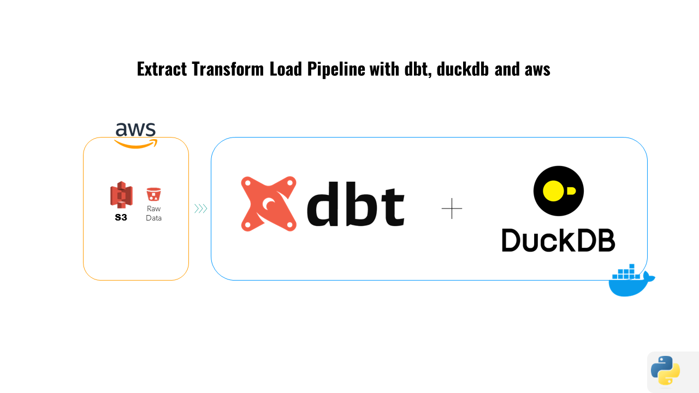

# Proyecto ETL de BikeTrip con DBT, DUCKDB y AWS

### Este proyecto implementa un pipeline ETL utilizando dbt (Data Build Tool) con DuckDB y AWS S3. 
### El objetivo es procesar y transformar datos de viajes en bicicleta almacenados en archivos CSV en S3 en un modelo dimensional con tablas de hechos y dimensiones.




## Estructura del Proyecto
```
dbtlab/
├── docker-compose.yml
├── dockerfile
└── dbt_project/
├── biketrip/
│ ├── analyses/
│ ├── macros/
│ ├── models/
│ │ ├── 01.staging/
│ │ │ └── stg_bike_trips.sql
│ │ ├── 02.cleaned/
│ │ │ └── cleaned_bike_trips.sql
│ │ ├── 03.enriched/
│ │ │ └── enriched_bike_trips.sql
│ │ ├── 04.structural/
│ │ │ └── formatted_trips.sql
│ │ ├── 05.datamart/
│ │ │ ├── dim_date.sql
│ │ │ ├── dim_stations.sql
│ │ │ └── fact_bike_trips.sql
│ │ └── schema.yml
│ ├── seeds/
│ ├── snapshots/
│ ├── tests/
│ ├── .gitignore
│ └── dbt_project.yml
├── logs/
└── .env
```

## Configuración del Entorno
### Requisitos Previos
- Docker
- Un bucket de AWS S3 con archivos CSV de datos de viajes en bicicleta
- Credenciales de AWS (Access Key ID y Secret Access Key)
- Fuente original de los [datos](https://s3.amazonaws.com/tripdata/index.html)

## Instrucciones
1. Construir la Imagen Docker

    Construye la imagen Docker usando el Dockerfile proporcionado:

```
docker-compose build
```
2. Iniciar el Contenedor Docker

    Inicia el contenedor Docker:
```
docker-compose up -d
```
3. Acceder al Contenedor

    Accede al contenedor en ejecución:
```
docker exec -it dbt_demo /bin/bash
```

4. Configurar Credenciales de AWS

    Dentro del contenedor, configura tus credenciales de AWS:
```
export AWS_ACCESS_KEY_ID="your-access-key-id"
export AWS_SECRET_ACCESS_KEY="your-secret-access-key"
```

5. Ejecutar dbt

    Navega al directorio del proyecto y ejecuta dbt:

```
dbt init biketrip
cd /dbt_project
dbt run
```
## Flujo Lógico de dbt con DuckDB
1. Modelos de Staging

    El modelo de staging (stg_bike_trips.sql) lee los archivos CSV desde S3 usando read_csv_auto y los combina en una sola tabla.

2. Modelos de Limpieza

    El modelo de limpieza (cleaned_bike_trips.sql) aplica transformaciones para limpiar los datos, como convertir cadenas de fechas a timestamps y normalizar nombres de estaciones.

3. Modelos de Enriquecimiento

    El modelo de enriquecimiento (enriched_bike_trips.sql) añade columnas calculadas como la duración del viaje y la distancia.

4. Modelos Estructurales

    El modelo estructural (formatted_trips.sql) refina aún más los datos, preparándolos para el modelo dimensional final.

5. Modelos de Datamart

    Los modelos de datamart (dim_date.sql, dim_stations.sql, fact_bike_trips.sql) crean las tablas de hechos y dimensiones finales utilizadas para el análisis.

## Acceder a DuckDB y Consultar las Tablas
1. Acceder al Contenedor

   Asegúrate de estar dentro del contenedor Docker en ejecución:

```
docker exec -it dbt_demo /bin/bash
```

2. Iniciar DuckDB

    Inicia el CLI de DuckDB con el archivo de base de datos generado:

```
duckdb /dbt_project/dev.duckdb
```

3. Consultar las Tablas

    Puedes ejecutar consultas SQL en las tablas creadas por dbt. Por ejemplo, para consultar las primeras 10 filas de la tabla fact_bike_trips:

```
SELECT * FROM main.fact_bike_trips LIMIT 10;
````


También puedes explorar otras tablas como dim_date y dim_stations:

```
SHOW TABLES;
SELECT * FROM main.dim_date LIMIT 10;
SELECT * FROM main.dim_stations LIMIT 10;
```
